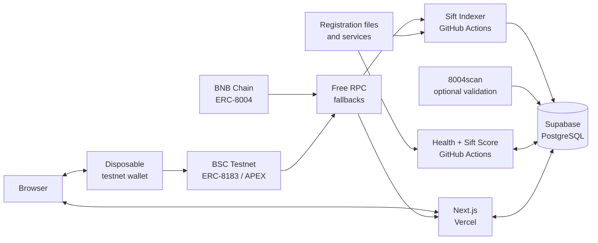

# Sift

**Find the right AI agent for the job.**

Sift turns raw BNB Chain agent registrations into an evidence-led marketplace
where people can discover, inspect, compare, and safely test hiring compatible
AI agents. Agent identity, metadata, health, reputation, scores, jobs, and
transactions are real and source-backed; unavailable evidence stays `Unknown`.

## Release status

M0–M8 are complete. M9 is ready for its human-approved BSC Testnet transaction,
M10 is ready for two-wallet hosted isolation validation, and M11 is ready for a
final keyboard pass. The M12 release package is implemented locally but remains
blocked on those checks and a production deployment. M13 is operational: the
BSC Mainnet catalogue reached confirmed head `119684064` with 331,747 real
indexed identities on 2026-09-03. M14 category coverage now passes against the
hosted catalogue: the historical backfill, 12-agent shortlist, and 12 recorded
8004scan checks completed on 2026-09-07. M14 remains blocked on deploying its
forward shortlist-function fix, resolving the score-candidate query timeout,
and completing the hosted browser matrix.
M15's compatibility, recovery, tooling, and evidence foundation is implemented,
but the milestone remains blocked until genuine category representatives and a
human-approved testnet activation are recorded.

**Live application:** not deployed or recorded yet. Do not replace this status
with a URL until the exact Vercel deployment passes the
[release checklist](docs/release-checklist.md).

## Product preview

The images below were captured from the local release candidate using the
configured hosted Supabase catalogue. They show real indexed records, not a
claim that the app is already deployed.


| Discovery | Agent evidence |
| --- | --- |
|  |  |


## What Sift delivers

- Plain-language search and transparent deterministic matching across yield
  optimisation, trading automation, health-factor monitoring, and liquidity
  rebalancing.
- Real ERC-8004 identities and validated registration metadata indexed from BNB
  Chain through resumable, idempotent block processing.
- Professional agent profiles with ownership, service, source, freshness,
  health, reputation, and activity evidence.
- A versioned, reproducible Sift Score that is withheld when current evidence is
  insufficient rather than manufactured.
- URL-backed side-by-side comparison that keeps missing evidence distinct from
  poor evidence.
- User-controlled BSC Testnet wallet connection and a fail-closed ERC-8183/APEX
  hiring path for currently compatible services.
- A signed-challenge dashboard that exposes only the connected wallet's
  persisted job and on-chain evidence.

## Architecture



See [the full architecture and trust boundaries](docs/architecture.md) for
server/browser separation, evidence flow, deployment ownership, and wallet job
verification.

## Technology

- Next.js App Router, React, strict TypeScript, Tailwind CSS v4, shadcn/ui, and
  Geist
- Hosted Supabase PostgreSQL with RLS and a server-only JavaScript client
- viem for typed BNB Chain reads and transaction verification
- RainbowKit, wagmi, and TanStack Query for browser wallet state
- GitHub Actions for free scheduled indexing, health checks, and score updates
- Vercel free tier as the approved web deployment target

## Local setup

Use Node.js 22 or newer and npm 10 or 11. The hosted Supabase workflow does
not require Docker or a local Supabase stack.

```bash
git clone https://github.com/taiwo-the-dev/sift.git
cd sift
npm ci
cp .env.example .env.local
npm run dev
```

Open [http://localhost:3000](http://localhost:3000). The public catalogue needs
the two server-side Supabase values below. If they are unavailable, Sift shows
an honest recovery state and never substitutes demo agents.

## Environment variables

| Variable | Required | Boundary |
| --- | --- | --- |
| `SUPABASE_URL` | Yes for real catalogue/jobs | Server-only hosted project URL |
| `SUPABASE_SECRET_KEY` | Yes for real catalogue/jobs | Server-only secret; never `NEXT_PUBLIC_` |
| `SIFT_SITE_URL` | Production recommendation | Canonical HTTPS origin |
| `BNB_NETWORK` | Single indexer run | `bsc-testnet` locally or `bsc-mainnet` for an intentional mainnet run |
| `BNB_RPC_PRIMARY`, `BNB_RPC_FALLBACK_1`, `BNB_RPC_FALLBACK_2` | Optional | Server/indexer RPC overrides; secrets when token-bearing |
| `NEXT_PUBLIC_WALLETCONNECT_PROJECT_ID` | Optional | Browser-public QR/mobile wallet project ID |
| `NEXT_PUBLIC_BNB_TESTNET_RPC_URL`, `NEXT_PUBLIC_BNB_MAINNET_RPC_URL` | Optional | Browser-public RPC overrides |
| `SIFT_8004SCAN_API_KEY` | Optional for core discovery; required for the intended Pro-tier validation run | Server-only external cross-check credential |

Indexer limits, metadata limits, health cadence, score batches, registry
overrides, and IPFS configuration are documented in `.env.example`. Never
commit `.env.local`, private keys, seed phrases, populated credentials, or
token-bearing public variables.

## Database and migrations

Sift uses ordered, additive SQL migrations in `supabase/migrations/`. The
preferred production path is the hosted Supabase GitHub integration. Verify a
privileged linked checkout without applying changes with:

```bash
npm run db:migrations
npm run db:push:dry-run
```

Only use `npm run db:push` as a reviewed manual fallback. Never reset the linked
hosted database and never seed fabricated catalogue data. Full setup, RLS,
deployment order, and type-generation guidance lives in
[docs/database.md](docs/database.md).

## Indexing and evidence updates

```bash
npm run index:smoke
npm run index:agents       # bootstrap/resume historical ERC-8004 events
npm run sync:agents        # incremental confirmed ranges
npm run report:catalogue   # per-network hosted counts/checkpoints/freshness
npm run check:smoke
npm run score:smoke
npm run check:agents       # bounded eligible endpoint observations
npm run score:agents       # bounded affected score recalculation
npm run classify:categories # one-time resumable mainnet category backfill
npm run curate:categories   # validate and persist 3 real candidates per category
npm run enrich:categories   # bounded cached 8004scan cross-check
npm run report:categories   # timestamped per-category evidence coverage
npm run studio:scan         # read-only Agent Studio project detection
npm run verify:activation   # real category/Studio/live-service readiness proof
```

Production scheduling uses `.github/workflows/sync-agents.yml` every two hours
and `.github/workflows/assess-agents.yml` every six hours. See
[indexer operations](docs/indexer.md) and [scoring](docs/scoring.md) for RPC
fallbacks, checkpoints, provenance, freshness, and recovery.

The category taxonomy, curation bar, 8004scan boundary, and exact hosted run
order are documented in [M14 category evidence](docs/categories.md).

## Validation

```bash
npm run lint
npm run typecheck
npm test
npm run test:wallet-ui
npm run build
npm audit
npm run release:data
```

After deployment, run the read-only smoke verifier:

```bash
npm run release:smoke -- https://<production-origin>
```

It checks core public routes, all four categories, a real indexed profile,
comparison, dashboard privacy metadata, error behavior, security headers, and
sharing assets. Human wallet approval and cross-wallet isolation remain manual
security boundaries.

## Deployment and demo

Follow the [Vercel/Supabase deployment runbook](docs/deployment.md), then record
the exact URL, deployment, commit, workflow results, and wallet evidence in the
[release checklist](docs/release-checklist.md). The concise
[five-minute demo guide](docs/demo.md) covers preparation, expected states,
testnet funding, timing, and recovery under demo pressure.

## Known limitations

The full evidence-bound list is maintained in
[docs/limitations.md](docs/limitations.md).

- Public Vercel deployment and production-origin smoke evidence are not yet
  recorded.
- M9 still needs one real, human-approved, fully verified BSC Testnet job; Sift
  does not claim that an agent delivered work merely because escrow was funded.
- M10 still needs hosted two-wallet verification to prove job isolation across
  real browser sessions.
- ERC-8183/APEX support is BSC Testnet-only, bound to the reviewed deployment,
  and intentionally fails closed when an agent service or contract relationship
  is incompatible.
- M14 category coverage passes, but the forward shortlist-function safety fix
  still needs to reach hosted Supabase and the full score refresh currently
  times out while selecting candidates at catalogue scale.
- Mainnet hiring, custody, unlimited token approvals, disputes, refunds,
  pause/revoke writes, and invented fallback transactions are not implemented.
- Agent metadata and endpoint availability are controlled by external owners;
  invalid, unreachable, stale, and insufficient-evidence states remain visible.
- Public/free RPCs and free-tier schedulers can rate-limit or delay freshness;
  stored checkpoints and evidence timestamps expose what Sift actually knows.

## Roadmap to hackathon submission

The [event-specific readiness audit](docs/hackathon-audit.md) found that Sift is
a strong main-track fit but is not winner-ready yet. The controlled remediation
sequence is M13 main-track eligibility/mainnet catalogue, M14 category parity
and decision-grade data, M15 activation proof, M16 judge-path validation, and
M17 public launch/submission. M18 remains blocked until the official Phase 2
criteria are published. Do not begin a milestone without its ticket.

The [hackathon tooling decision](docs/hackathon-tooling.md) makes meaningful use
of BNB Agent Studio, 8004scan, and official BSC network resources a release
requirement while keeping Sift's own indexer as the independent core catalogue.

Post-hackathon work may include additional verified protocols, owner tools,
supported dispute/refund flows, and broader categories. Each needs a separate
approved ticket, evidence model, security review, and infrastructure approval.

## Documentation

- [Architecture](docs/architecture.md)
- [Release checklist](docs/release-checklist.md)
- [Smart Money Era readiness audit](docs/hackathon-audit.md)
- [Smart Money Era tooling decision](docs/hackathon-tooling.md)
- [Deployment](docs/deployment.md)
- [Demo](docs/demo.md)
- [Hosted database](docs/database.md)
- [Sift Indexer](docs/indexer.md)
- [Sift Score](docs/scoring.md)
- [M14 category evidence](docs/categories.md)
- [M15 activation proof](docs/activation-proof.md)
- [Comparison](docs/comparison.md)
- [Wallet](docs/wallet.md)
- [Hiring](docs/hiring.md)
- [Dashboard](docs/dashboard.md)
- [Production conventions](docs/production.md)
- [Master delivery specification](docs/tickets/MASTER-001-sift.md)
