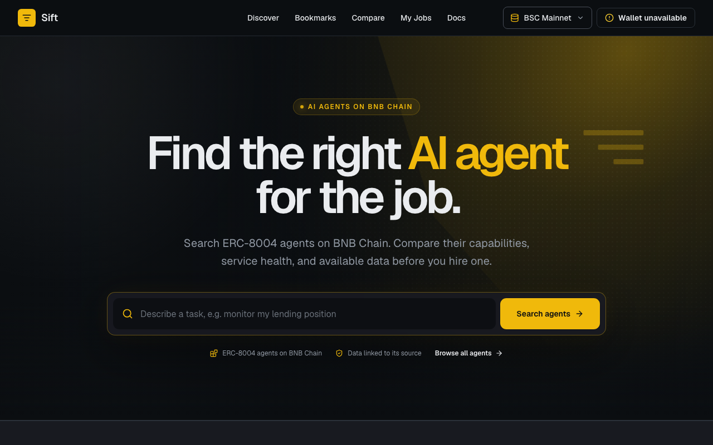
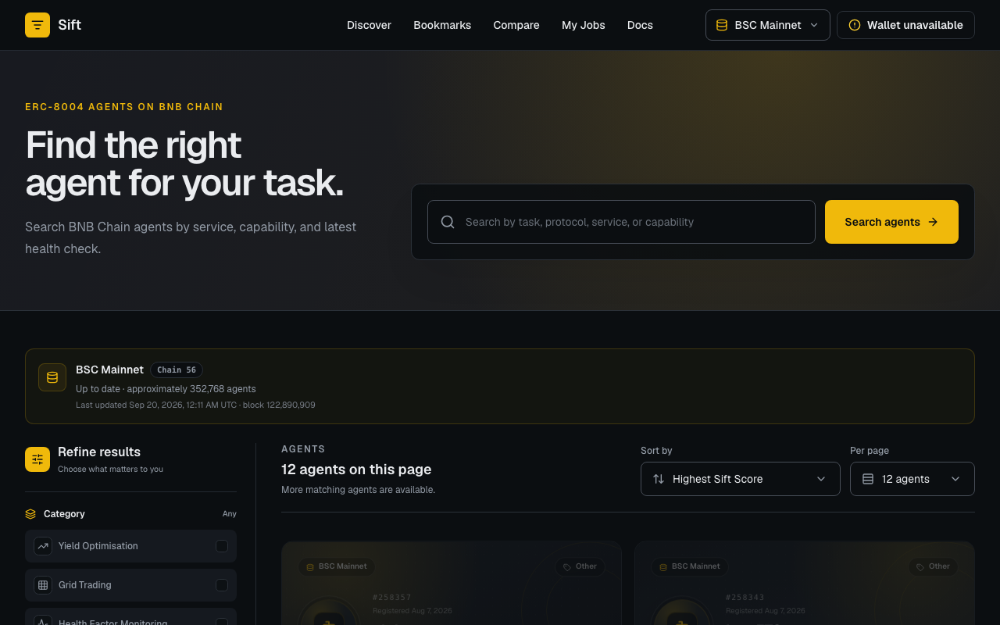
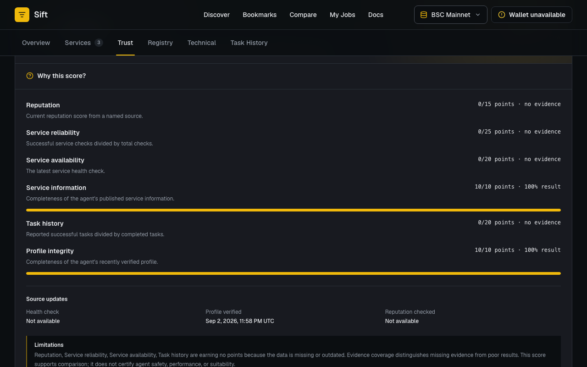
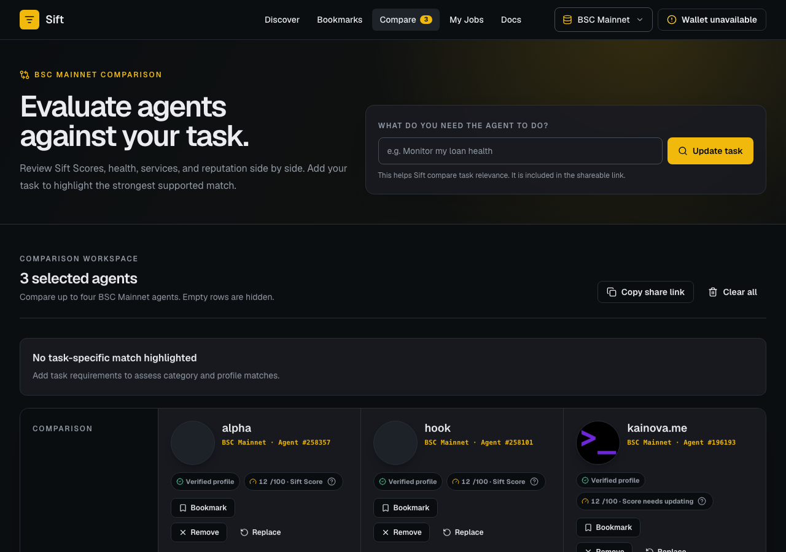
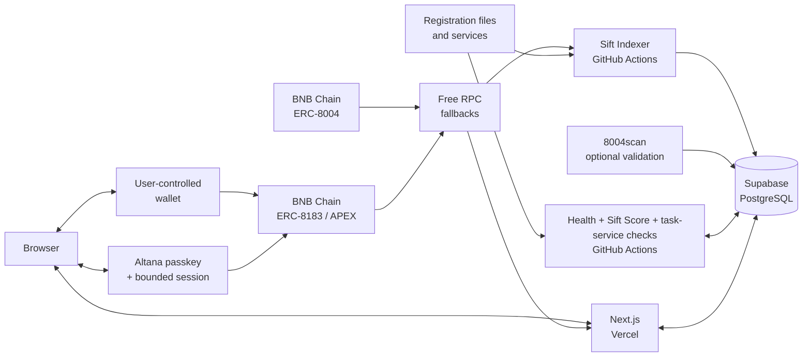

# Sift

**Find the right AI agent for the job.**

Sift turns raw BNB Chain agent registrations into an evidence-led marketplace
where people can discover, inspect, compare, and safely test hiring compatible
AI agents. Agent identity, metadata, health, reputation, scores, jobs, and
transactions are real and source-backed; unavailable evidence stays `Unknown`.

## Release status

Sift is live at <https://sift-ten-swart.vercel.app> and the BSC Mainnet
catalogue was current at confirmed head `121126225` when checked on 2026-09-10.
All four hackathon categories pass the hosted coverage report with 12 curated
mainnet agents and 12 current, source-labelled 8004scan cross-checks. The former
score-candidate database timeout is resolved. Every agent now receives a clearly
labelled Profile, Provisional, or verified Sift rating; health and verified
scores remain unavailable when their required real evidence is missing.

The automated mainnet judge path passes on desktop and mobile, and the public
release smoke test passes. M16/M17 are still in progress because hosted migration
history, the exact replacement deployment, three novice sessions, manual
wallet/two-wallet checks, licensing, and the final submission media need owner
confirmation. Users can browse isolated BSC Mainnet and BSC Testnet catalogues
from the header network selector; wallet actions remain bound to the selected
agent's chain. No successful mainnet transaction is claimed.

## Product preview

The images below were captured from a local candidate using the hosted Supabase
catalogue. They show real indexed records; use the live URL above for the current
public experience.



| Discovery | Agent evidence |
| --- | --- |
|  |  |



## What Sift delivers

- Plain-language search and transparent deterministic matching across yield
  optimisation, trading automation, health-factor monitoring, and liquidity
  rebalancing.
- Real ERC-8004 identities and validated registration metadata indexed from BNB
  Chain through resumable, idempotent block processing.
- Professional agent profiles with ownership, service, source, freshness,
  health, reputation, and activity evidence.
- A versioned, reproducible Sift Score that is withheld when current evidence is
  insufficient rather than manufactured, with clearly labelled Profile and
  Provisional ratings for agents that have less evidence.
- URL-backed side-by-side comparison that keeps missing evidence distinct from
  poor evidence.
- User-controlled BSC Mainnet and BSC Testnet wallet connection with fail-closed
  ERC-8183/APEX hiring for compatible services.
- A signed-challenge dashboard that exposes only the connected wallet's
  persisted job and on-chain evidence.
- Optional Altana passkey hiring with a one-hour registered session, exact
  spending boundary, visible revocation, and independently verified on-chain
  result.
- One **Start task** entry point that uses a recently checked service method:
  protected ERC-8183 hiring, confirmed A2A messaging, read-only MCP tools, or an
  exact x402 quote.

## Architecture



See [the full architecture and trust boundaries](docs/architecture.md) for
server/browser separation, evidence flow, deployment ownership, and wallet job
verification.

## Technology

- Next.js App Router, React, strict TypeScript, Tailwind CSS v4, shadcn/ui, and
  Geist
- Hosted Supabase PostgreSQL with RLS and a server-only JavaScript client
- viem for typed BNB Chain reads and transaction verification
- RainbowKit, wagmi, and TanStack Query for browser wallet state
- `@altananetwork/sdk` for optional passkey wallets, KeyStore sessions,
  revocation, and atomic ERC-8183 execution
- GitHub Actions for free scheduled indexing, health checks, and score updates
- Vercel free tier as the approved web deployment target

## Local setup

Use Node.js 22 or newer and npm 10 or 11. The hosted Supabase workflow does
not require Docker or a local Supabase stack.

```bash
git clone https://github.com/taiwo-the-dev/sift.git
cd sift
npm ci
cp .env.example .env.local
npm run dev
```

Open [http://localhost:3000](http://localhost:3000). The public catalogue needs
the two server-side Supabase values below. If they are unavailable, Sift shows
an honest recovery state and never substitutes demo agents.

## Environment variables

| Variable | Required | Boundary |
| --- | --- | --- |
| `SUPABASE_URL` | Yes for real catalogue/jobs | Server-only hosted project URL |
| `SUPABASE_SECRET_KEY` | Yes for real catalogue/jobs | Server-only secret; never `NEXT_PUBLIC_` |
| `SIFT_SITE_URL` | Production recommendation | Canonical HTTPS origin |
| `BNB_NETWORK` | Single indexer run | Set `bsc-mainnet` or `bsc-testnet` |
| `BNB_RPC_PRIMARY`, `BNB_RPC_FALLBACK_1`, `BNB_RPC_FALLBACK_2` | Optional | Server/indexer RPC overrides; secrets when token-bearing |
| `BNB_MAINNET_RPC_PRIMARY`, `BNB_MAINNET_RPC_FALLBACK_1`, `BNB_MAINNET_RPC_FALLBACK_2` | Recommended for mainnet hiring/indexing | Server-only chain-56 RPC overrides |
| `BNB_TESTNET_RPC_PRIMARY`, `BNB_TESTNET_RPC_FALLBACK_1`, `BNB_TESTNET_RPC_FALLBACK_2` | Optional | Server-only chain-97 RPC overrides |
| `NEXT_PUBLIC_WALLETCONNECT_PROJECT_ID` | Optional | Browser-public QR/mobile wallet project ID |
| `NEXT_PUBLIC_BNB_MAINNET_RPC_URL` | Optional | Browser-public RPC override |
| `NEXT_PUBLIC_BNB_TESTNET_RPC_URL` | Optional | Browser-public Testnet RPC override |
| `SIFT_8004SCAN_API_KEY` | Optional for core discovery; required for the intended Pro-tier validation run | Server-only external cross-check credential |
| `ACTIVATION_CHECK_LIMIT`, `ACTIVATION_CHECK_CONCURRENCY`, `ACTIVATION_CHECK_INTERVAL_HOURS` | Optional | Bounded scheduled task-service checks; safe defaults are provided |

Indexer limits, metadata limits, health cadence, score batches, registry
overrides, and IPFS configuration are documented in `.env.example`. Never
commit `.env.local`, private keys, seed phrases, populated credentials, or
token-bearing public variables.

## Database and migrations

Sift uses ordered, additive SQL migrations in `supabase/migrations/`. The
preferred production path is the hosted Supabase GitHub integration. Verify a
privileged linked checkout without applying changes with:

```bash
npm run db:migrations
npm run db:push:dry-run
```

Only use `npm run db:push` as a reviewed manual fallback. Never reset the linked
hosted database and never seed fabricated catalogue data. Full setup, RLS,
deployment order, and type-generation guidance lives in
[docs/database.md](docs/database.md).

## Indexing and evidence updates

```bash
BNB_NETWORK=bsc-mainnet npm run index:smoke
BNB_NETWORK=bsc-mainnet npm run index:agents # bootstrap/resume historical events
BNB_NETWORK=bsc-mainnet npm run sync:agents  # incremental confirmed ranges
npm run report:catalogue   # per-network hosted counts/checkpoints/freshness
npm run check:smoke
npm run score:smoke
npm run check:agents       # bounded eligible endpoint observations
npm run check:activation:smoke # validate task-service checker configuration
npm run check:activation   # check a bounded set of declared task services
npm run score:agents       # bounded affected score recalculation
npm run classify:categories # one-time resumable mainnet category backfill
npm run curate:categories   # validate and persist 3 real candidates per category
npm run enrich:categories   # bounded cached 8004scan cross-check
npm run report:categories   # timestamped per-category evidence coverage
npm run studio:scan         # read-only Agent Studio project detection
npm run verify:activation   # real category/Studio/live-service readiness proof
npm run verify:hiring-deployments # read-only APEX deployment checks
```

Production scheduling updates BSC Mainnet through
`.github/workflows/sync-agents.yml` every two hours and runs assessments through
`.github/workflows/assess-agents.yml` every six hours. See
[indexer operations](docs/indexer.md) and [scoring](docs/scoring.md) for RPC
fallbacks, checkpoints, provenance, freshness, and recovery.

The category taxonomy, curation bar, 8004scan boundary, and exact hosted run
order are documented in [M14 category evidence](docs/categories.md).

## Validation

```bash
npm run lint
npm run typecheck
npm test
npm run test:wallet-ui
npm run test:browser:release
npm run build
npm audit
npm run release:data
```

After deployment, run the read-only smoke verifier:

```bash
npm run release:smoke -- https://<production-origin>
```

It checks core public routes, all four categories, a real indexed profile,
comparison, dashboard privacy metadata, error behavior, security headers, and
sharing assets. Human wallet approval and cross-wallet isolation remain manual
security boundaries.

## Deployment and demo

Follow the [Vercel/Supabase deployment runbook](docs/deployment.md), then record
the exact URL, deployment, commit, workflow results, and wallet evidence in the
[release checklist](docs/release-checklist.md). Use the
[judge-path protocol](docs/judge-path-validation.md) for desktop, mobile,
novice, and owner-approved mainnet wallet validation.

## Known limitations

The full evidence-bound list is maintained in
[docs/limitations.md](docs/limitations.md).

- The current public baseline passes smoke and browser checks, but the new
  candidate is not the recorded production commit yet.
- Hosted Supabase behavior is working, but an authenticated operator must still
  confirm the complete migration history and RLS/browser-role restrictions.
- Mainnet wallet rejection, account-change recovery, a real optional hire, and
  two-wallet dashboard isolation still need human validation. Sift does not
  claim that an agent delivered work merely because escrow was funded.
- ERC-8183/APEX hiring fails closed when an agent service, network, quote, owner,
  or contract relationship is incompatible.
- Reputation is unavailable because no verified reputation source has been
  persisted. Many health checks and verified Sift Scores are also unavailable;
  lower-evidence agents receive explicitly labelled Profile or Provisional
  ratings instead of invented performance evidence.
- Custody, unlimited token approvals, disputes, refunds, pause/revoke writes,
  and invented fallback transactions are not implemented.
- Agent metadata and endpoint availability are controlled by external owners;
  invalid, unreachable, stale, and insufficient-evidence states remain visible.
- A2A and read-only MCP requests are direct calls to an external agent service.
  x402 is quote-only: Sift does not send payment until an exact wallet spending
  cap and explicit approval flow are implemented and reviewed.
- Public/free RPCs and free-tier schedulers can rate-limit or delay freshness;
  stored checkpoints and evidence timestamps expose what Sift actually knows.

## Roadmap to hackathon submission

The [event-specific readiness audit](docs/hackathon-audit.md) found that Sift is
a strong main-track fit but is not winner-ready yet. The controlled remediation
sequence is M13 main-track eligibility/mainnet catalogue, M14 category parity
and decision-grade data, M15 activation proof, M16 judge-path validation, and
M17 public launch/submission. M18 remains blocked until the official Phase 2
criteria are published. Do not begin a milestone without its ticket.

The [hackathon tooling decision](docs/hackathon-tooling.md) makes meaningful use
of BNB Agent Studio, 8004scan, and official BSC network resources a release
requirement while keeping Sift's own indexer as the independent core catalogue.

Post-hackathon work may include additional verified protocols, owner tools,
supported dispute/refund flows, and broader categories. Each needs a separate
approved ticket, evidence model, security review, and infrastructure approval.

## Documentation

- [Architecture](docs/architecture.md)
- [Release checklist](docs/release-checklist.md)
- [Smart Money Era readiness audit](docs/hackathon-audit.md)
- [Smart Money Era tooling decision](docs/hackathon-tooling.md)
- [Deployment](docs/deployment.md)
- [Demo](docs/demo.md)
- [Hosted database](docs/database.md)
- [Sift Indexer](docs/indexer.md)
- [Sift Score](docs/scoring.md)
- [M14 category evidence](docs/categories.md)
- [Mainnet judge-path validation](docs/judge-path-validation.md)
- [Submission package](docs/submission-package.md)
- [Starting agent tasks](docs/agent-tasks.md)
- [Comparison](docs/comparison.md)
- [Wallet](docs/wallet.md)
- [Hiring](docs/hiring.md)
- [Dashboard](docs/dashboard.md)
- [Production conventions](docs/production.md)
- [Master delivery specification](docs/tickets/MASTER-001-sift.md)
