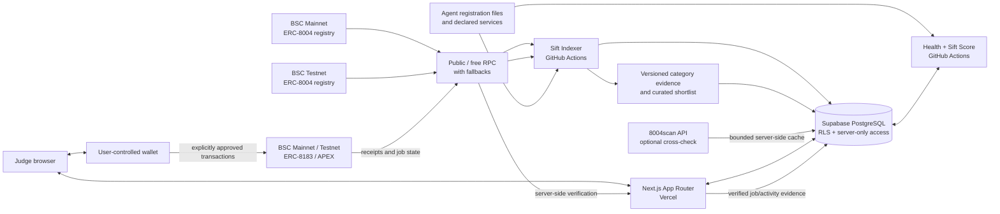

# Sift architecture

Sift is an evidence-led discovery, comparison, BNB Chain hiring, and monitoring
layer for AI agents on BNB Chain. The catalogue and evidence shown to users are
source-backed; unavailable inputs remain visibly unavailable.

## Runtime boundaries

- The Sift Indexer reads confirmed ERC-8004 registry events, validates bounded
  external metadata, and writes normalized identities and services. Mainnet and
  testnet use identity keys and checkpoints scoped by chain and registry. The
  indexer has no wallet or signing key.
- The health and score workflow checks eligible public declarations in bounded
  batches, records the observation source/time, and calculates a versioned Sift
  Score only when enough current evidence exists.
- The shared M14 taxonomy classifies validated metadata during indexing and a
  resumable historical backfill. Discovery reads materialized evidence instead
  of rescanning the catalogue or duplicating keyword rules in UI code.
- 8004scan is an optional validation/enrichment boundary for the 12-agent
  shortlist. Its key, requests, raw cache, normalized evidence and failures
  remain server-side. Sift discovery never depends on that service.
- Next.js Server Components and server route handlers read through typed,
  server-only repositories. `SUPABASE_SECRET_KEY` never enters the browser.
- The browser owns wallet interaction. Sift requests each mainnet or testnet action
  explicitly and never receives a private key or seed phrase.
- After a transaction, the server independently checks the sender, chain,
  destination, calldata, receipt, event, confirmations, and protocol state
  before recording it as confirmed.
- Dashboard access requires a short-lived signed ownership challenge. Opaque
  session material is held in HttpOnly cookies; only digests are persisted.

## Deployment topology

| Layer | Deployment | Purpose |
| --- | --- | --- |
| Web | Vercel free tier | Next.js pages, metadata, server reads, verification APIs |
| Data | Hosted Supabase free tier | PostgreSQL catalogue, evidence, jobs, activity, wallet sessions |
| Scheduled operations | GitHub Actions | Two-hour incremental indexing and six-hour health/scoring batches |
| Chain reads | Public/free BNB RPC fallbacks | ERC-8004 ingestion and ERC-8183 verification |
| Wallet writes | User-controlled wallet | Explicit chain-bound BSC Mainnet or Testnet ERC-8183/APEX transactions only |

The detailed database, indexer, scoring, hiring, dashboard, and security
contracts are documented in their focused files under `docs/`. This diagram
must be updated if a deployment boundary changes.

Discovery is BSC-mainnet-first for the judge journey, with an explicit testnet
or combined catalogue selection. ERC-8183 hiring supports only the separately
reviewed chain-56 and chain-97 deployments. Quotes, RPC reads, wallet clients,
stored jobs, receipt verification, and explorer links remain bound to the
agent's chain. Mainnet requires a real-funds acknowledgement and every write
still requires explicit wallet confirmation.
